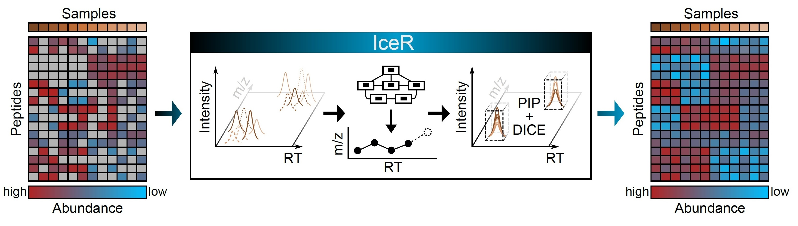
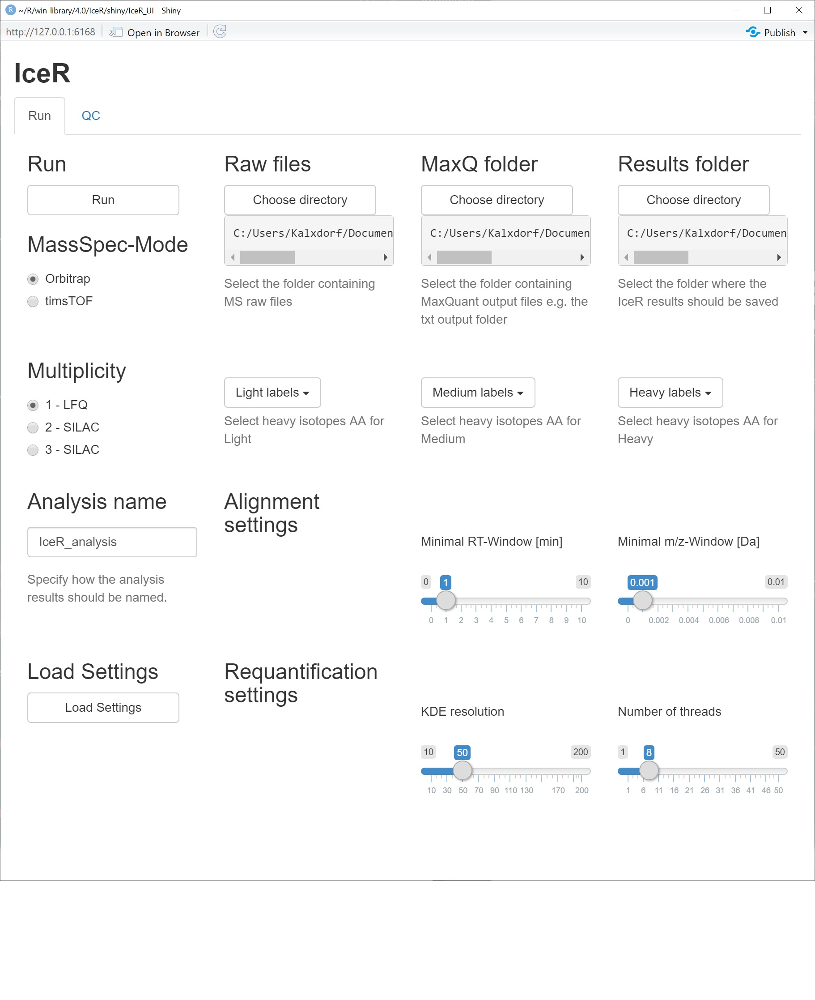
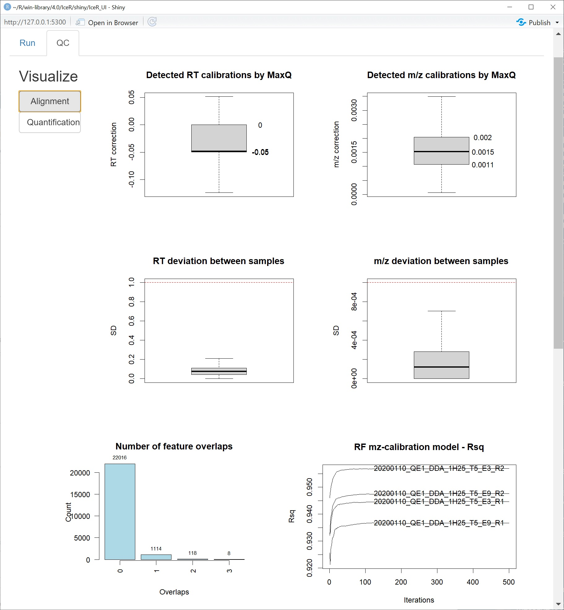
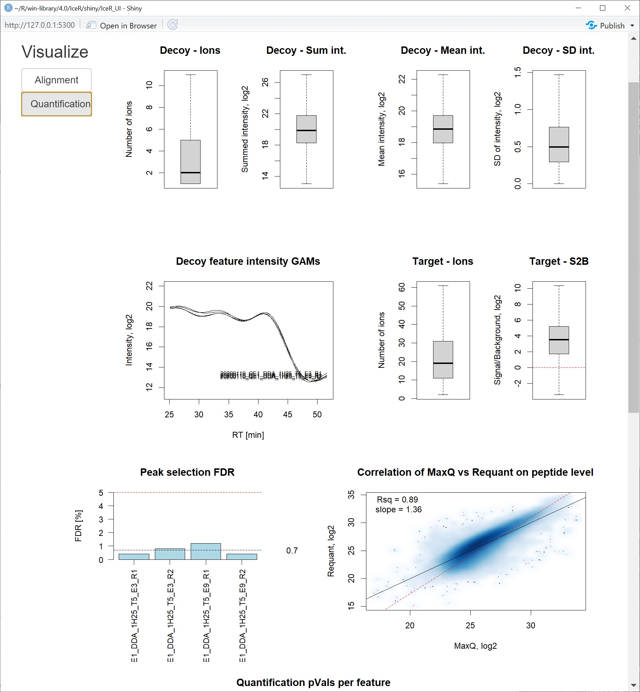
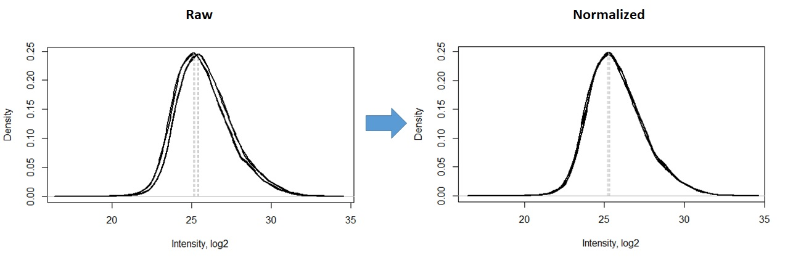
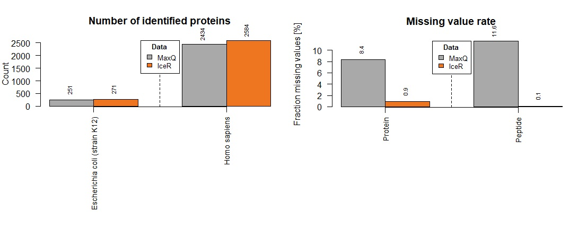
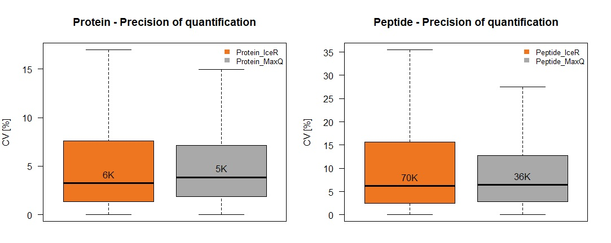
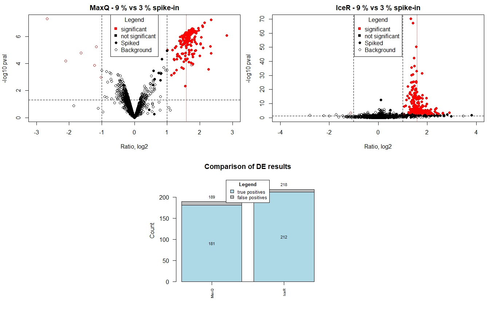

<p align="center"> 

</p>

### Description
Label-free proteomics enables the unbiased quantification of thousands of proteins across large sample cohorts. Commonly used mass spectrometry-based proteomic workflows rely on data dependent acquisition (DDA). However, its stochastic selection of peptide features for fragmentation-based identification inevitably results in high rates of missing values, which prohibits the integration of larger cohorts as the number of recurrently detected peptides is a limiting factor. Peptide identity propagation (PIP) can mitigate this challenge, allowing to transfer sequencing information between samples. However, despite the promise of these approaches, current methods remain limited either in sensitivity or reliability and there is a lack of robust and widely applicable software. To address this, we here present IceR, an efficient and user-friendly quantification workflow introducing a hybrid PIP approach with superior quantification precision, accuracy, reliability and data completeness. IceR is available as an easy to-use R-package incorporating a graphical user interface and comprehensive quality control measures.

### Installation
The following installations are required:

 - [R](https://cran.r-project.org/bin/windows/base/) (Version 3.63 or above)
 - [Rtools](https://cran.r-project.org/bin/windows/Rtools/history.html) (select required version)
 - Optional: [ProteoWizard](http://proteowizard.sourceforge.net/download.html)
 - Optional: [RStudio](https://rstudio.com/products/rstudio/download/)
 
During installation, please keep default settings and follow respective instructions.

Next, we install the IceR package from GitHub
```r
install.packages("devtools")
devtools::install_github("mathiaskalxdorf/IceR")
```
If everything wents fine, IceR should be installed and can be used (e.g. with the GUI) with the following lines:
```r
library(IceR)
runIceR()
```
### Prerequisites
IceR was yet only tested on Windows 10 but should work on other OS as well. 

The current version of IceR requires raw MS files (from Thermo Mass Spectrometers or from Bruker TIMS-ToF pro) to be preprocessed with MaxQuant (tested for Versions 1.5.1.2, 1.6.12 and 1.6.14, versions in between should work as well). Important note: Fasta file should be parsed correctly. In this case the column "Gene names" can be found in the proteinGroups.txt. Furthermore, raw Orbitrap files are required in the mzXML format and raw TIMS-ToF data has to be converted into a readable format. If msconvert from ProteoWizard is installed, IceR triggers conversion automatically. Otherwise, the user has to place the converted files in the folder "mzXML" in case of orbitrap data within the folder containing the raw files. Conversion of Bruker TIMS-ToF pro data is currently only possible if msConvert is installed. 

Generally, the more ressources are available the faster the data analysis can be performed. Still, IceR can run reasonably well even on a normal PC/Laptop. However, in case of TIMS-ToF data a potent machine will be required due to the huge file sizes. Here it is recommended to at least allocate 128 gb of RAM to enable at maximum 3 samples to be processed in parallel. Furthermore, TIMS-ToF raw data currently has to be converted (automatically triggered by IceR, requires msConvert to be installed) into a readable format which requires several hours per sample and at least 50 gb of space on the machines home drive. A future version of IceR will implement a faster conversion method.

### Example
For this example, we will require [ProteoWizard](http://proteowizard.sourceforge.net/download.html) to be installed as raw files will have to be converted.

The example data set is stored [here](https://drive.google.com/drive/folders/1te8awhyliY4vKCCxjUdwJNJD_YlYjHJf?usp=sharing).

Please download the raw files and (to speed things up) the corresponding MaxQuant results. This example data set consists of 4 tool MS files representing 2 replicates of human lysate spiked with 3 % E. coli lysate and 2 replicates of human lysate spiked with 9 % E. coli lysate. This data was acquired on a Q-Exactive HF machine. Supplied MaxQuant results were generated using MaxQuant V1.5.1.2. Used search database from UniProt is supplied.

After running ...
```r
library(IceR)
runIceR()
```
... the GUI opens.
<p align="center"> 

</p>

It allows setting up the IceR run. Among others, the following parameters can be modified:

 - Paths to raw files, MaxQuant results files and IceR output folder
 - MassSpec Mode switching between Orbitrap and TIMS-ToF data (with or without using TIMS dimension)
 - Analysis name
 - Retention (RT) and m/z feature alignment windows
 - Kernel density estimation (KDE) resolution (increasing resolution increases computation workload but also increases resolution of peak detections) 
 - Number of peaks to be stored per quantification
 - Diagnostic and statistical significance cutoffs for quantifications
 - Number of threads to be used during IceR workflow (please check on your system specifications. Should not be higher than numbers of samples to be analyzed. Number of threads should be also adapted to available RAM. In case of TIMS-ToF data, a single 2h gradient acquisition run will require ~ 40 gb of RAM, hence, number of threads will be automatically limited in this case to 3 parallel threads)

We can keep all settings at default (changes of some parameters are disabled at the moment) but reduce number of threads to 4. 

Please specify the path to the downloaded raw files and MaxQuant results by clicking on the respective "Choose directory" buttons. Similarly, please specify a folder where IceR results should be stored.

After clicking on "Total process", the IceR workflow will start. A detailed description of the individual steps can be found in the original publication [IceR](https://www.biorxiv.org/content/10.1101/2020.11.01.363101v1.full)

A recent computational system should be able to complete the IceR workflow for the example data set within 2 - 3 hours.

When IceR finished, some quality control plots for the alignment and quantification can be visualized by clicking on the tap "QC" and subsequently on the respective button:

<p align="center"> 

</p>

<p align="center"> 

</p>

Subsequently, we can investigate results in more detail and compare results to MaxQuant outputs.

We need two additional R-packages to be installed for the following steps.
```{r}
install.packages("BiocManager")
BiocManager::install("PECA")
install.packages("http://cran.r-project.org/src/contrib/Archive/rowr/rowr_1.1.3.tar.gz", repos=NULL, type="source")
```
Now we load IceR library.
```{r}
library(IceR)
```

Next, we load IceR and MaxQ data using the respective functions supplyed by the IceR package. A file-choose box will open to specify the location of the respective data. 

```{r}
IceR <- load_Requant_data()
MaxQ <- load_MaxQ_data()
```
Add annotation information to both data sets. The first two samples correspond to two replicates of 3 % E.coli lysate spiked into constant human background. The second two samples correspond to 9 % E.coli spike-in conditions.
```{r}
anno <- data.frame(Spike = c(3,3,9,9))
IceR <- add_annotations(IceR,anno)
MaxQ <- add_annotations(MaxQ,anno)
```
Next, perform median normalization of protein- and peptide-level data based on background proteome (human proteins).
```{r}
IceR$Protein_level$Quant_data_norm <- normalize_data(IceR$Protein_level$Quant_data,method = "median",main = "IceR - Protein-level data",norm_on_subset = which(IceR$Protein_level$Meta_data$Organism == "Homo sapiens"))
IceR$Peptide_level$Quant_data_norm <- normalize_data(IceR$Peptide_level$Quant_data,method = "median",main = "IceR - Peptide-level data",norm_on_subset = which(IceR$Peptide_level$Meta_data$Organism == "Homo sapiens"))
MaxQ$Protein_level$Quant_data_norm <- normalize_data(MaxQ$Protein_level$Quant_data,method = "median",main = "MaxQ - Protein-level data",norm_on_subset = which(MaxQ$Protein_level$Meta_data$Organism == "Homo sapiens"))
MaxQ$Peptide_level$Quant_data_norm <- normalize_data(MaxQ$Peptide_level$Quant_data,method = "median",main = "MaxQ - Peptide-level data",norm_on_subset = which(MaxQ$Peptide_level$Meta_data$Organism == "Homo sapiens"))
```
<p align="center"> 

</p>

We continue with a look on general numbers per data set.
```{r}
MaxQ <- determine_general_numbers(MaxQ)
IceR <- determine_general_numbers(IceR)

compare_general_numbers(list(MaxQ=MaxQ,IceR=IceR),colors = c("darkgrey","chocolate2"))
```
<p align="center"> 

</p>

We see a clear reduction of missing values.

Check CVs of quantification in both data sets.
```{r}
plot_accuracy(list(MaxQ=MaxQ,IceR=IceR),inset = c(0,0),Legendpos = "topright",colors = c("chocolate2","darkgrey"))
```
<p align="center"> 

</p>

We see similar CVs in MaxQuant and IceR data, however, more data points are available especially on peptide level in case of IceR data.

Finally, we perform differential expression (DE) analysis. Perform DE on protein-level in case of MaxQ data and on peptide-level (using PECA) in case of IceR data to make use of the highly increased amount of available data for IceR results. As IceR robustly infers protein abundances e.g. using the MaxLFQ algorithm, DE analyses could be of course also performed on protein-level.

```{r}
DE_MaxQ <- LIMMA_analysis(MaxQ$Protein_level$Quant_data_norm,assignments = MaxQ$Annotations$Spike,contrast = "9_vs_3")
DE_IceR <- PECA_analysis(IceR$Peptide_level$Quant_data_norm,ids = IceR$Peptide_level$Meta_data$Gene_name,anno = IceR$Annotations$Spike,group1_name = "9",group2_name = "3")
```

Now plot Volcano plots with significance cutoffs (dashed black lines) at adj.pval < 0.05 and abs. logfc >= 1. Shape data points based on organism. Indicate true ratio (dashed red line). Add barchart representing number of detected true positives and false positives.

```{r}
plot(DE_MaxQ$logFC,-log10(DE_MaxQ$P.Value),xlab="Ratio, log2",ylab="-log10 pval",main="MaxQ - 9 % vs 3 % spike-in",col=ifelse(abs(DE_MaxQ$logFC)>=1 & DE_MaxQ$adj.P.Val < 0.05,"red","black"),pch=ifelse(rownames(DE_MaxQ) != toupper(rownames(DE_MaxQ)),19,1),xlim=c(-3,3))
abline(h=-log10(0.05),lty=2)
abline(v=1,lty=2)
abline(v=-1,lty=2)
abline(v=log2(9/3),lty=3,col="red")
legend("top",legend = c("significant","not significant","Spiked","Background"),title = "Legend",col=c("red","black","black","black"),pch=c(15,15,19,1))

plot(DE_IceR$logFC,-log10(DE_IceR$P.Value),xlab="Ratio, log2",ylab="-log10 pval",main="IceR - 9 % vs 3 % spike-in",col=ifelse(abs(DE_IceR$logFC)>=1 & DE_IceR$adj.P.Val < 0.05,"red","black"),pch=ifelse(rownames(DE_IceR) != toupper(rownames(DE_IceR)),19,1),xlim=c(-4,4))
abline(h=-log10(0.05),lty=2)
abline(v=1,lty=2)
abline(v=-1,lty=2)
abline(v=log2(9/3),lty=3,col="red")
legend("top",legend = c("significant","not significant","Spiked","Background"),title = "Legend",col=c("red","black","black","black"),pch=c(15,15,19,1))

MaxQ_TP <- length(which(DE_MaxQ$logFC>=1 & DE_MaxQ$adj.P.Val < 0.05 & rownames(DE_MaxQ) != toupper(rownames(DE_MaxQ))))
MaxQ_FP <- length(which(abs(DE_MaxQ$logFC)>=1 & DE_MaxQ$adj.P.Val < 0.05 & rownames(DE_MaxQ) == toupper(rownames(DE_MaxQ))))
IceR_TP <- length(which(DE_IceR$logFC>=1 & DE_IceR$adj.P.Val < 0.05 & rownames(DE_IceR) != toupper(rownames(DE_IceR))))
IceR_FP <- length(which(abs(DE_IceR$logFC)>=1 & DE_IceR$adj.P.Val < 0.05 & rownames(DE_IceR) == toupper(rownames(DE_IceR))))
plot_Data <- data.frame(MaxQ=c(MaxQ_TP,MaxQ_FP),IceR=c(IceR_TP,IceR_FP))
Barplotsstacked(plot_Data,AvgLine = F,col=c("lightblue","grey"),margins = c(4,4,4,12),Legends = c("true positives","false positives"),Legendpos = "top",inset = c(0,0),main="Comparison of DE results",ylab="Count")
```

<p align="center"> 

</p>

We see an increase in true positives by +23 % in case of the IceR analysis. Number of false positives is comparable.

